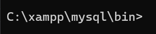
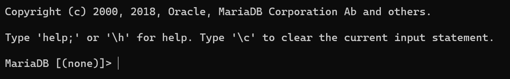
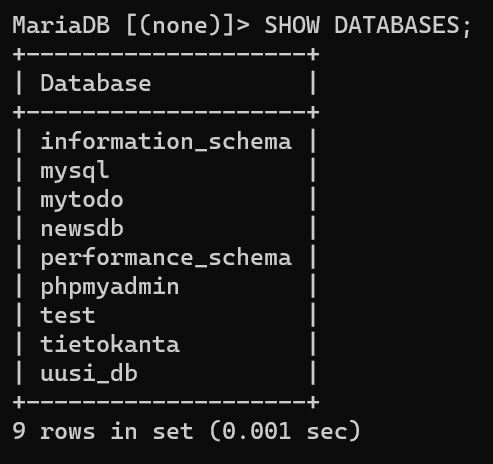
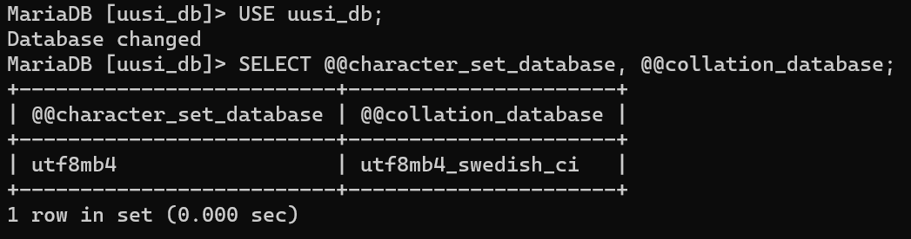
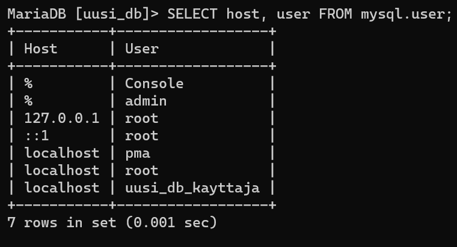
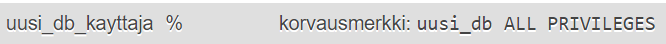
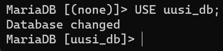
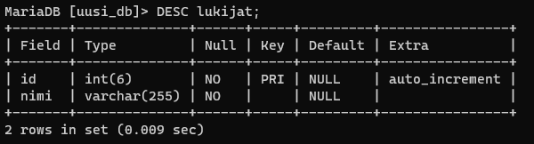
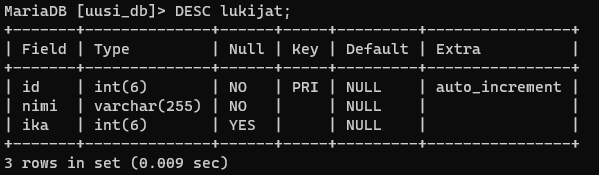
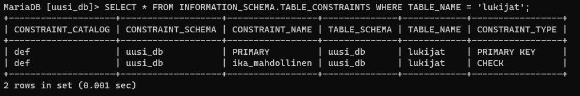

SQL-kielen Tehtävä <!-- omit from toc -->
===

### sisällysluettelo: <!-- omit from toc -->
- [1 CLI -päätteen avaaminen terminaalissa](#1-cli--päätteen-avaaminen-terminaalissa)
  - [1.1 Avaa CMD, ja siirry polkuun `\xampp\mysql\bin`](#11-avaa-cmd-ja-siirry-polkuun-xamppmysqlbin)
  - [1.2 Käynnistä yhteys SQL-palvelimeen komentokehoitteesta.](#12-käynnistä-yhteys-sql-palvelimeen-komentokehoitteesta)
- [2 Tietokannan ja käyttäjän luominen](#2-tietokannan-ja-käyttäjän-luominen)
  - [2.1 Luodaan uusi tietokanta nimellä `uusi_db`](#21-luodaan-uusi-tietokanta-nimellä-uusi_db)
  - [2.2 Asetetaan tietokannan merkistö](#22-asetetaan-tietokannan-merkistö)
  - [2.3 Luodaan tietokannalle käyttäjä](#23-luodaan-tietokannalle-käyttäjä)
  - [2.4 Asetetaan käyttäjän `uusi_db_kayttaja` oikeudet](#24-asetetaan-käyttäjän-uusi_db_kayttaja-oikeudet)
  - [2.4 Kirjaudutaan sisään käyttäen luotua käyttäjää](#24-kirjaudutaan-sisään-käyttäen-luotua-käyttäjää)
- [3 Taulukoiden luominen tietokantaan](#3-taulukoiden-luominen-tietokantaan)
  - [3.1 Luodaan taulukko `lukijat`](#31-luodaan-taulukko-lukijat)
  - [3.2 Luodaan taulukko `kirjat`](#32-luodaan-taulukko-kirjat)


Tietokannan luominen ja muokkaaminen SQL-kielellä CLI (*Command Line Interface*) -päätteessä

*Tehtävässä käytetään XAMPP-ympäristöä joka on ilmainen. Voit asentaa sen [tästä](https://www.apachefriends.org/download.html)*<br>
*Älä käytä tähän tehtävään XAMPP:in omaa visuaalista SQL-ympäristöä, vaan toteuta tehtävä kokonaan terminaalissa*

*Käytä tehtävään apuna [README.md](README.md) -tiedostoa ja [w3schoolin nettisivuja](https://www.w3schools.com/sql/default.asp).*

*Tehtävässä on apuna vihjeitä, ja vastauksia. Pyri tekemään tehtävä ilman vihjeitä niin pitkälle kuin pystyt*

## 1 CLI -päätteen avaaminen terminaalissa

### 1.1 Avaa CMD, ja siirry polkuun `\xampp\mysql\bin`<br>
XAMPP on useimmiten asennettu aseman `C:` juureen

> <details>
> <summary>Vihje 1</summary>
> <br>
>
> Käytä komentoa `cd` siirtyäksesi kansioon `c:\xampp\mysql\bin`
>
> Komennolla `cd ..` voi liikkua taaksepäin kansioissa
>
> </details>
<br>

**Terminaalin polun tulisi nyt näyttää tältä:**<br>



><details>
><summary>Koodi</summary>
><br>
>
>```powershell
>cd C:\xampp\mysql\bin
>```
>
></details>
<br>

*huom, XAMPP saattaa olla asennettuna toiseen tiedostosijaintiin*

### 1.2 Käynnistä yhteys SQL-palvelimeen komentokehoitteesta.

Käytä sovellusta mysql.exe yhteyden muodostamiseen

><details>
><summary>Vihje 1</summary>
><br>
>
> mysql.exe -sovellus tarvitsee parametrin `-u` (`--user`), ja tarvittaessa myös `-p` (`--password`)
>
></details>
<br>

><details>
><summary>Vihje 2</summary>
><br>
>
> käytä käyttäjää `root` kun kirjaudut sisään SQL-palvelimelle
>
> `root` -käyttäjälle ei ole oletuksena asetettu salasanaa
>
> *huom, jos `root` -käyttäjä ei toimi, voi olla että joku on asettanut käyttäjälle salasanan, tai käyttäjä on poistettu käytöstä*
>
></details>
<br>

**Terminaalin pitäisi nyt avautua CLI-päätteeseen:**



><details>
><summary>Koodi</summary>
><br>
>
> ```powershell
> mysql.exe -u root
> ```
>
></details>
<br>

## 2 Tietokannan ja käyttäjän luominen

### 2.1 Luodaan uusi tietokanta nimellä `uusi_db`

*jos tietokanta on jo olemassa, keksi teitokannalle uusi nimi*

><details>
><summary>Vihje 1</summary>
><br>
>
> Käytä komentoa `CREATE DATABASE`
>
></details>
<br>

**Käytetään komentoa `SHOW DATABASES;`, ja tarkistetaan että tietokannan luonti onnistui:**



><details>
><summary>Koodi</summary>
><br>
>
> ```SQL
> CREATE DATABASE uusi_db;
> ```
>
></details>
<br>

### 2.2 Asetetaan tietokannan merkistö

Käytä komentoa:
```SQL
ALTER DATABASE <tietokanta> <parametrit>;
```

merkistöä muutetaan parametreilla `CHARACTER SET` ja `COLLATE`

Käytä `utf8mb4` -merkistöä, ja aseta järjestykseksi ruotsi (swedish)

><details>
><summary>Vihje 1</summary>
><br>
>
> järjestyksen parametri on `utf8mb4_swedish_ci`
>
></details>
<br>

><details>
><summary>Vihje 2</summary>
><br>
>
> Parametrejen muoto on
> ```SQL
> ... CHARACTER SET <parametri> COLLATE <parametri>;
> ```
>
></details>
<br>

Voit tarkistaa tietokannan käyttämän merkistön komennoilla:
```SQL
-- USE <tietokanta>;
USE uusi_db;

SELECT @@character_set_database, @@collation_database;
```


><details>
><summary>Koodi</summary>
><br>
>
> ```SQL
> ALTER DATABASE uusi_db CHARACTER SET 'utf8mb4' COLLATE 'utf8mb4_swedish_ci';
> ```
>
></details>
<br>

### 2.3 Luodaan tietokannalle käyttäjä

**Tietokantaa käyttäessä kannattaa välttää `root` -käyttäjän käyttämistä, sillä jos tekee vahingossa jonkin muutoksen, voi sen seuraukset olla laajat. Luodaan juuri luodulle tietokannalle käyttäjä joka ei voi muokata muita tietokantoja.**

**`root` -käyttäjän tulisi olla disabloitu aina, kun palvelin on yhteydessä internettiin. Sen sijasta tulisi käyttää `admin` -käyttäjää jolla on salasana.**

Käytetään komentoa `CREATE USER` ja luodaan käyttäjä `uusi_db_kayttaja` salasanalla `Kissa123`.

><details>
><summary>Vihje 1</summary>
><br>
>
> komennon muoto on:
> ```SQL
> CREATE USER <käyttäjänimi> IDENTIFIED BY <salasana>;
> ```
>
></details>
<br>

voit nähdä kaikki käyttäjät komennolla:
```SQL
SELECT host, user FROM mysql.user;
```


><details>
><summary>Koodi</summary>
><br>
>
> ```SQL
> CREATE USER uusi_db_kayttaja IDENTIFIED BY 'Kissa123';
> ```
>
></details>
<br>

### 2.4 Asetetaan käyttäjän `uusi_db_kayttaja` oikeudet

Käytä komentoa `GRANT ALL PRIVILEDGES`, ja anna käyttäjälle `uusi_db_kayttaja` kaikki oikeudet tietokantaan `uusi_db`

><details>
><summary>Vihje 1</summary>
><br>
>
> komennon muoto on 
> ```SQL
> GRANT ALL PRIVILEGES ON <tietokanta>.* TO <käyttäjä>@'%';
> ```
>
></details>
<br>

*Komennon ei tulisi antaa yhtään virheilmoitusta*

**Voit tarkistaa käyttäjän oikeudet phpMyAdminista**

Avaa uusi_db -tietokanta, ja paina kohtaa käyttöoikeudet.

Näkymässä tulisi olla seuraavanlainen käyttäjä:


><details>
><summary>Koodi</summary>
><br>
>
> ```SQL
> GRANT ALL PRIVILEDGES ON uusi_db.* TO 'uusi_db_kayttaja'@'%';
> ```
>
></details>
<br>

*Voit poistaa käyttäjiä komenolla `DROP USER <käyttäjä>;`*

### 2.4 Kirjaudutaan sisään käyttäen luotua käyttäjää

Sulje ensin yhteys SQL-palvelimeen komennolla `exit`, sen jälkeen yhdistetään palvelimeen uudelleen käyttämällä taas `mysql.exe` -sovellusta, mutta tällä kertaa käyttäjänimi on `uusi_db_kayttaja`.

><details>
><summary>Vihje 1</summary>
><br>
>
> Tällä kertaa tarvitset parametria `-p`
>
></details>
<br>

><details>
><summary>Koodi</summary>
><br>
>
> ```powershell
> mysql.exe -u uusi_db_kayttaja
> > Kissa123
> ```
>
></details>
<br>

*Varmista että kirjoitat salasanan oikein.*

*päätteen tulisi taas näyttää samalta:*


## 3 Taulukoiden luominen tietokantaan

**Ennen taulukoiden luomista tai muokkaamista, varmista että olet valinnut oikean tietokannan**

Käytä komentoa
```SQL
USE uusi_db;
```
valitaksesi juuri luodun tietokannan

Valittu tietokanta näkyy päätteessä:



### 3.1 Luodaan taulukko `lukijat`

Luo taulukko nimellä `lukijat` <br>
Taulukkoon tulee sauraavat kentät:

`id` (int(6), primary key, not null, auto increment) - lukijan id<br>
`nimi` (varchar(255), not null) - lukijan nimi<br>

Käytä komentoa `CREATE TABLE`

*SQL-kieli ei välitä rivinvaihdoista, käytä tätä hyväksesi.*

><details>
><summary>Vihje 1</summary>
><br>
>
> komennon muoto on:
> ```SQL
> CREATE TABLE <taulukko> (
>    <sarake1> <argumentit>,
>    ...
> );
> ```
>
></details>
<br>

><details>
><summary>Vihje 2</summary>
><br>
>
> argumenttien muodot:
> ```SQL
> NOT NULL
> PRIMARY KEY
> AUTO_INCREMENT
> ```
>
>
></details>
<br>

**Komennon suorituksen jälkeen kokeillaan toimiko taulukon luonti:**

Käytä komentoa `DESCRIBE TABLE <taulukko>;`<br>
Taulukon pitäisi nyt näyttää tältä:




Lisätään vielä sarake `ika` käyttäjän iälle. Käytä sarakkeen lisäämiseen komentoa `ALTER TABLE`. `Ika` -sarake saa olla tyhjä.

><details>
><summary>Vihje 1</summary>
><br>
>
> komennon muoto on:
> ```SQL
> ALTER TABLE <taulukko> ADD [COLUMN] <sarake> <argumentit>
> ```
>
></details>
<br>

><details>
><summary>Vihje 2</summary>
><br>
>
> Argumantti `NOT NULL` määrittää että sarakkeen tiedot eivät saa olla tyhjiä.
>
></details>
<br>

Sen jälkeen asetetaan `CONSTRAINT`, `CHECK` -argumentilla, eli vaatimuksella `ika` -sarakkeelle jolla tarkistetaan että ikä ei ole negatiivinen, ja että ikä ei ole yli 120 vuotta

Komennon muoto on:
```SQL
ALTER TABLE <tietokanta> ADD CONSTRAINT <vaatimus> CHECK(<argumentit>)
```

><details>
><summary>Vihje 1</summary>
><br>
>
> argumenttien väliin täytyy asettaa `AND` -operaattori
>
> Vaatimukselle täytyy myöskin asettaa nimi
>
></details>
<br>

><details>
><summary>Vihje 2</summary>
><br>
>
> Argumentit ovat: `ika <= 120`, ja `ika >= 0`
>
></details>
<br>

`lukijat` -taulukon tulisi nyt näyttää tältä:



Vaatimukset voidaan tarkistaa komennolla:
```SQL
SELECT * FROM INFORMATION_SCHEMA.TABLE_CONSTRAINTS WHERE TABLE_NAME = 'lukijat';
```

Vastauksen tulisi näyttää tältä:



><details>
><summary>Koodi</summary>
><br>
>
> ```SQL
> -- luodaan taulukko 'lukijat'
> -- sarakkeina id ja nimi
> CREATE TABLE lukijat (
> id int(6) NOT NULL PRIMARY KEY, AUTO_INCREMENT,
> nimi varchar(255) NOT NULL
> );
>
> -- lisätään 'ika' sarake. Huom, saa olla tyhjä, ei NOT NULL -argumenttia
> ALTER TABLE lukijat ADD ika int(6);
>
> -- lisätään CONSTRAINT CHECK, jotta ikä on aina oikealla alueella
> ALTER TABLE lukijat ADD CONSTRAINT ika_mahdollinen CHECK(ika <= 120 AND ika >= 0);
> 
> -- tarkistetaan että kaikki on lisätty oikein. DESC = DESCRIBE -kumennon lyhennetty muoto
> DESC lukijat;
>
> -- tarkistetaan myös että vaatimus on asetettu
> SELECT * FROM INFORMATION_SCHEMA.TABLE_CONSTRAINTS WHERE TABLE_NAME = 'lukijat';
> ```
>
></details>
<br>

### 3.2 Luodaan taulukko `kirjat`

luo taulukko nimellä `kirjat` <br>
Taulukkoon tulee ainakin seuraavat kentät:

`nimi` - kirjan nimi<br>
`luettu` - onko kirja luettu vai kesken<br>
`sivumaara` - kirjan sivujen määrä, saa olla tyhjä<br>
`lukija_id` - lukijan id

**Luodaan `FOREIGN KEY`, eli vierasavain kentälle `lukija_id` vasta seuraavassa vaiheessa.**

*muista myös asettaa PRIMARY KEY -kenttä*

><details>
><summary>Vihje 1</summary>
><br>
>
> Aseta taulukon ensimmäiseksi sarakkeeksi `id` -kenttä, joka toimii pääavaimena
>
></details>
<br>

><details>
><summary>Vihje 2</summary>
><br>
>
> Käytä `luettu` -kentässä datatyyppiä `BOOLEAN` = `BOOL`
>
> Datatyypissä `BOOLEAN` luku 0 saa arvon `false` ja positiiviset luvut arvon `true`
>
></details>
<br>

Asetetaan seuraavaksi sarakkeelle `lukija_id` `FOREIGN KEY` -argumentti joka on yhteydessä `lukijat` -taulukon `id` -kenttään

Käytä syntaksia:
```SQL
... FOREIGN KEY REFERENCES <taulukko>(<sarake>)
```

Käytetään komennossa argumenttia `MODIFY`

><details>
><summary>Vihje 1</summary>
><br>
>
> Käytä komentoa `ALTER TABLE <taulukko> MODIFY ...`
>
></details>
<br>

><details>
><summary>Vihje 2</summary>
><br>
>
> Sinun tulee asettaa kaikki argumentit uudelleen, kun muokkaat kenttää `lukija_id`.
>
></details>
<br>

Käytä komentoa jolla saat taulukon tiedot. Vastauksen tulisi näyttää tältä:


><details>
><summary></summary>
><br>
></details>
<br>

-kuvia tietokannan GUI:sta<br>
-käyttäjän tekeminen

