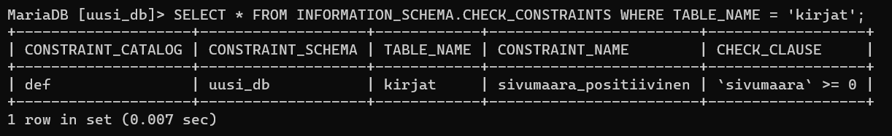

SQL-kielen Tehtävä <!-- omit from toc -->
===

### sisällysluettelo: <!-- omit from toc -->
- [1 CLI -päätteen avaaminen terminaalissa](#1-cli--päätteen-avaaminen-terminaalissa)
  - [1.1 Avaa CMD, ja siirry polkuun `\xampp\mysql\bin`](#11-avaa-cmd-ja-siirry-polkuun-xamppmysqlbin)
  - [1.2 Käynnistä yhteys SQL-palvelimeen komentokehoitteesta.](#12-käynnistä-yhteys-sql-palvelimeen-komentokehoitteesta)
- [2 Tietokannan ja käyttäjän luominen](#2-tietokannan-ja-käyttäjän-luominen)
  - [2.1 Luodaan uusi tietokanta nimellä `uusi_db`](#21-luodaan-uusi-tietokanta-nimellä-uusi_db)
  - [2.2 Asetetaan tietokannan merkistö](#22-asetetaan-tietokannan-merkistö)
  - [2.3 Luodaan tietokannalle käyttäjä](#23-luodaan-tietokannalle-käyttäjä)
  - [2.4 Asetetaan käyttäjän `uusi_db_kayttaja` oikeudet](#24-asetetaan-käyttäjän-uusi_db_kayttaja-oikeudet)
  - [2.4 Kirjaudutaan sisään käyttäen luotua käyttäjää](#24-kirjaudutaan-sisään-käyttäen-luotua-käyttäjää)
- [3 Taulukoiden luominen tietokantaan](#3-taulukoiden-luominen-tietokantaan)
  - [3.1 Luodaan taulukko `lukijat`](#31-luodaan-taulukko-lukijat)
  - [3.3 Luodaan taulukko `kirjat`](#33-luodaan-taulukko-kirjat)
  - [3.3 Kokeillaan asetettuja rajoituksia](#33-kokeillaan-asetettuja-rajoituksia)
- [4 tuodaan tietoja taulukoihin](#4-tuodaan-tietoja-taulukoihin)
  - [4.1 Tuodaan taulukoihin tietoja tiedostosta data.sql.](#41-tuodaan-taulukoihin-tietoja-tiedostosta-datasql)
  - [4.2 lisätään taulukkoon omia tietoja](#42-lisätään-taulukkoon-omia-tietoja)
  - [4.3 Yhdistetään taulukoita](#43-yhdistetään-taulukoita)
  - [4.3 Muutetaan taulukoiden tietoja](#43-muutetaan-taulukoiden-tietoja)
    - [1. tehtävä](#1-tehtävä)
    - [2. tehtävä](#2-tehtävä)


Tietokannan luominen ja muokkaaminen SQL-kielellä CLI (*Command Line Interface*) -päätteessä

Tehtävän tarkoituksena on opettaa SQL-kielen käyttämistä CLI-ympäristössä

*Tehtävässä käytetään XAMPP-ympäristöä joka on ilmainen. Voit asentaa sen [tästä](https://www.apachefriends.org/download.html)*<br>
*Älä käytä tähän tehtävään XAMPP:in omaa visuaalista SQL-ympäristöä, vaan toteuta tehtävä kokonaan terminaalissa*

*Käytä tehtävään apuna [README.md](README.md) -tiedostoa ja [w3schoolin nettisivuja](https://www.w3schools.com/sql/default.asp).*

***Tehtävässä on apuna vihjeitä, ja vastauksia. Pyri tekemään tehtävät käyttämällä vihjeitä ja vastauksia mahdollisimman vähän.***

## 1 CLI -päätteen avaaminen terminaalissa

### 1.1 Avaa CMD, ja siirry polkuun `\xampp\mysql\bin`<br>
XAMPP on useimmiten asennettu aseman `C:` juureen

> <details>
> <summary>Vihje 1</summary>
> <br>
>
> Käytä komentoa `cd` siirtyäksesi kansioon `c:\xampp\mysql\bin`
>
> Komennolla `cd ..` voi liikkua taaksepäin kansioissa
>
> </details>
<br>

**Terminaalin polun tulisi nyt näyttää tältä:**<br>


><details>
><summary>Koodi</summary>
><br>
>
>```powershell
>cd C:\xampp\mysql\bin
>```
>
></details>
<br>

*huom, XAMPP saattaa olla asennettuna toiseen tiedostosijaintiin*

### 1.2 Käynnistä yhteys SQL-palvelimeen komentokehoitteesta.

Käytä sovellusta mysql.exe yhteyden muodostamiseen

><details>
><summary>Vihje 1</summary>
><br>
>
> mysql.exe -sovellus tarvitsee parametrin `-u` (`--user`), ja tarvittaessa myös `-p` (`--password`)
>
></details>
<br>

><details>
><summary>Vihje 2</summary>
><br>
>
> käytä käyttäjää `root` kun kirjaudut sisään SQL-palvelimelle
>
> `root` -käyttäjälle ei ole oletuksena asetettu salasanaa
>
> *huom, jos `root` -käyttäjä ei toimi, voi olla että joku on asettanut käyttäjälle salasanan, tai käyttäjä on poistettu käytöstä*
>
></details>
<br>

**Terminaalin pitäisi nyt avautua CLI-päätteeseen:**


><details>
><summary>Koodi</summary>
><br>
>
> ```powershell
> mysql.exe -u root
> ```
>
></details>
<br>

## 2 Tietokannan ja käyttäjän luominen

### 2.1 Luodaan uusi tietokanta nimellä `uusi_db`

*jos tietokanta on jo olemassa, keksi teitokannalle uusi nimi*

><details>
><summary>Vihje 1</summary>
><br>
>
> Käytä komentoa `CREATE DATABASE`
>
></details>
<br>

**Käytetään komentoa `SHOW DATABASES;`, ja tarkistetaan että tietokannan luonti onnistui:**


><details>
><summary>Koodi</summary>
><br>
>
> ```SQL
> CREATE DATABASE uusi_db;
> ```
>
></details>
<br>

### 2.2 Asetetaan tietokannan merkistö

Käytä komentoa:
```SQL
ALTER DATABASE <tietokanta> <parametrit>;
```

merkistöä muutetaan parametreilla `CHARACTER SET` ja `COLLATE`

Käytä `utf8mb4` -merkistöä, ja aseta järjestykseksi ruotsi (swedish)

><details>
><summary>Vihje 1</summary>
><br>
>
> järjestyksen parametri on `utf8mb4_swedish_ci`
>
></details>
<br>

><details>
><summary>Vihje 2</summary>
><br>
>
> Parametrejen muoto on
> ```SQL
> ... CHARACTER SET <parametri> COLLATE <parametri>;
> ```
>
></details>
<br>

Voit tarkistaa tietokannan käyttämän merkistön komennoilla:
```SQL
-- USE <tietokanta>;
USE uusi_db;

SELECT @@character_set_database, @@collation_database;
```


><details>
><summary>Koodi</summary>
><br>
>
> ```SQL
> ALTER DATABASE uusi_db CHARACTER SET 'utf8mb4' COLLATE 'utf8mb4_swedish_ci';
> ```
>
></details>
<br>

### 2.3 Luodaan tietokannalle käyttäjä

**Tietokantaa käyttäessä kannattaa välttää `root` -käyttäjän käyttämistä, sillä jos tekee vahingossa jonkin muutoksen, voi sen seuraukset olla laajat. Luodaan juuri luodulle tietokannalle käyttäjä joka ei voi muokata muita tietokantoja.**

**`root` -käyttäjän tulisi olla disabloitu aina, kun palvelin on yhteydessä internettiin. Sen sijasta tulisi käyttää `admin` -käyttäjää jolla on salasana.**

Käytetään komentoa `CREATE USER` ja luodaan käyttäjä `uusi_db_kayttaja` salasanalla `Kissa123`.

><details>
><summary>Vihje 1</summary>
><br>
>
> komennon muoto on:
> ```SQL
> CREATE USER <käyttäjänimi> IDENTIFIED BY <salasana>;
> ```
>
></details>
<br>

voit nähdä kaikki käyttäjät komennolla:
```SQL
SELECT host, user FROM mysql.user;
```


><details>
><summary>Koodi</summary>
><br>
>
> ```SQL
> CREATE USER uusi_db_kayttaja IDENTIFIED BY 'Kissa123';
> ```
>
></details>
<br>

*Voit poistaa käyttäjiä komenolla `DROP USER <käyttäjä>;`*

### 2.4 Asetetaan käyttäjän `uusi_db_kayttaja` oikeudet

Käytä komentoa `GRANT ALL PRIVILEGES`, ja anna käyttäjälle `uusi_db_kayttaja` kaikki oikeudet tietokantaan `uusi_db`

><details>
><summary>Vihje 1</summary>
><br>
>
> komennon muoto on 
> ```SQL
> GRANT ALL PRIVILEGES ON <tietokanta>.* TO <käyttäjä>@'%';
> ```
>
></details>
<br>

*Komennon ei tulisi antaa yhtään virheilmoitusta*

**Voit tarkistaa käyttäjän oikeudet phpMyAdminista**

Avaa uusi_db -tietokanta, ja paina kohtaa käyttöoikeudet.

Näkymässä tulisi olla seuraavanlainen käyttäjä:


><details>
><summary>Koodi</summary>
><br>
>
> ```SQL
> GRANT ALL PRIVILEGES ON uusi_db.* TO 'uusi_db_kayttaja'@'%';
> ```
>
></details>
<br>

### 2.4 Kirjaudutaan sisään käyttäen luotua käyttäjää

Sulje ensin yhteys SQL-palvelimeen komennolla `exit`, sen jälkeen yhdistetään palvelimeen uudelleen käyttämällä taas `mysql.exe` -sovellusta, mutta tällä kertaa käyttäjänimi on `uusi_db_kayttaja`.

><details>
><summary>Vihje 1</summary>
><br>
>
> Tällä kertaa tarvitset parametria `-p`
>
></details>
<br>

><details>
><summary>Koodi</summary>
><br>
>
> ```powershell
> mysql.exe -u uusi_db_kayttaja
> > Kissa123
> ```
>
></details>
<br>

*Varmista että kirjoitat salasanan oikein.*

*päätteen tulisi taas näyttää tältä:*


## 3 Taulukoiden luominen tietokantaan

**Ennen taulukoiden luomista tai muokkaamista, varmista että olet valinnut oikean tietokannan**

Käytä komentoa
```SQL
USE uusi_db;
```
valitaksesi juuri luodun tietokannan

Valittu tietokanta näkyy päätteessä:


### 3.1 Luodaan taulukko `lukijat`

Luo taulukko nimellä `lukijat` <br>
Taulukkoon tulee sauraavat kentät:

`id` (int(6), primary key, not null, auto increment) - lukijan id<br>
`nimi` (varchar(255), not null) - lukijan nimi<br>

Käytä komentoa `CREATE TABLE`

*int(6) on luku, jonka pituus on 6 merkkiä (max 999 999), ei luku jonka maksimi on 6*

*SQL-kieli ei välitä rivinvaihdoista, käytä tätä hyväksesi.*

><details>
><summary>Vihje 1</summary>
><br>
>
> komennon muoto on:
> ```SQL
> CREATE TABLE <taulukko> (
>    <sarake1> <argumentit>,
>    ...
> );
> ```
>
></details>
<br>

><details>
><summary>Vihje 2</summary>
><br>
>
> argumenttien muodot:
> ```SQL
> NOT NULL
> PRIMARY KEY
> AUTO_INCREMENT
> ```
>
>
></details>
<br>

**Komennon suorituksen jälkeen kokeillaan toimiko taulukon luonti:**

Käytä komentoa `DESCRIBE <taulukko>;`<br>
Taulukon pitäisi nyt näyttää tältä:


*komento `DESC` on lyhenne komennosta `DESCRIBE`*

Lisätään vielä sarake `ika` käyttäjän iälle. Käytä sarakkeen lisäämiseen komentoa `ALTER TABLE`. `ika` -sarake saa olla tyhjä.

><details>
><summary>Vihje 1</summary>
><br>
>
> komennon muoto on:
> ```SQL
> ALTER TABLE <taulukko> ADD [COLUMN] <sarake> <argumentit>
> ```
>
></details>
<br>

><details>
><summary>Vihje 2</summary>
><br>
>
> Argumantti `NOT NULL` määrittää että sarakkeen tiedot eivät saa olla tyhjiä.
>
></details>
<br>

Sen jälkeen asetetaan `CONSTRAINT`, `CHECK` -argumentilla, eli vaatimuksella `ika` -sarakkeelle jolla tarkistetaan että ikä ei ole negatiivinen, ja että ikä ei ole yli 120 vuotta

Komennon muoto on:
```SQL
ALTER TABLE <taulukko> ADD CONSTRAINT [<vaatimuksen nimi>] CHECK(<argumentit>)
```

*SQL-palvelin asettaa vaatimuksille nimet automaattisesti jos nimeä ei aseteta*

><details>
><summary>Vihje 1</summary>
><br>
>
> argumenttien väliin täytyy asettaa `AND` -operaattori
>
> Vaatimukselle täytyy myöskin asettaa nimi
>
></details>
<br>

><details>
><summary>Vihje 2</summary>
><br>
>
> Argumentit ovat: `ika <= 120`, ja `ika >= 0`
>
></details>
<br>

`lukijat` -taulukon tulisi nyt näyttää tältä:


Kaikki vaatimukset voidaan tarkistaa komennolla:
```SQL
SELECT * FROM INFORMATION_SCHEMA.TABLE_CONSTRAINTS WHERE TABLE_NAME = 'lukijat';
```

Vastauksen tulisi näyttää tältä:


*Vaatimuksen sisällöt löytyvät tietokannasta sys, johon käyttäjällä `uusi_db_kayttaja` ei ole pääsyä*

`CHECK` -vaatimusten sisällöt voi tarkistaa komennolla:
```SQL
SELECT * FROM INFORMATION_SCHEMA.CHECK_CONSTRAINTS WHERE TABLE_NAME = 'lukijat';
```


Jos sinulla on ylimääräisiä vaatimuksia, voit poistaa ne komennolla
```SQL
ALTER TABLE <taulukko> DROP CONSTRAINT <vaatimus>;
```

<br>

><details>
><summary>Koodi</summary>
><br>
>
> ```SQL
> -- luodaan taulukko 'lukijat'
> -- sarakkeina id ja nimi
> CREATE TABLE lukijat (
> id int(6) NOT NULL PRIMARY KEY, AUTO_INCREMENT,
> nimi varchar(255) NOT NULL
> );
>
> -- lisätään 'ika' sarake. Huom, saa olla tyhjä, ei NOT NULL -argumenttia
> ALTER TABLE lukijat ADD ika int(6);
>
> -- lisätään CONSTRAINT CHECK, jotta ikä on aina oikealla alueella
> ALTER TABLE lukijat ADD CONSTRAINT ika_mahdollinen CHECK(ika <= 120 AND ika >= 0);
> 
> -- tarkistetaan että kaikki on lisätty oikein. DESC = DESCRIBE -kumennon lyhennetty muoto
> DESC lukijat;
>
> -- tarkistetaan että vaatimus on asetettu
> SELECT * FROM INFORMATION_SCHEMA.TABLE_CONSTRAINTS WHERE TABLE_NAME = 'lukijat';
> 
> -- tarkistetaan vaatimuksen sisältö
> SELECT * FROM INFORMATION_SCHEMA.CHECK_CONSTRAINTS WHERE TABLE_NAME = 'lukijat';
> ```
>
></details>
<br>

### 3.3 Luodaan taulukko `kirjat`

luo taulukko nimellä `kirjat` <br>
Taulukkoon tulee ainakin seuraavat kentät:

`nimi` - kirjan nimi<br>
`luettu` - onko kirja luettu vai kesken<br>
`sivumaara` - kirjan sivujen määrä, saa olla tyhjä<br>
`lukija_id` - lukijan id

*muista myös asettaa PRIMARY KEY -kenttä*

><details>
><summary>Vihje 1</summary>
><br>
>
> Aseta taulukon ensimmäiseksi sarakkeeksi `id` -kenttä, joka toimii pääavaimena
>
></details>
<br>

><details>
><summary>Vihje 2</summary>
><br>
>
> Käytä `luettu` -kentässä datatyyppiä `BOOLEAN` = `BOOL`
>
> Datatyypissä `BOOLEAN` luku 0 saa arvon `false` ja positiiviset luvut arvon `true`
>
></details>
<br>

Asetetaan seuraavaksi sarakkeelle `lukija_id` `FOREIGN KEY` -argumentti joka on yhteydessä `lukijat` -taulukon `id` -kenttään

*`FOREIGN KEY` on vaatimus SQL -kielessä, joka varmistaa että arvo on olemassa toisessa taulukossa. Jos esimerkiksi halutaan yhdistää käyttäjät ja käyttäjien lähettämät postaukset, yhdistetään taulukkoon `postaukset` sarake jossa kerrotaan kuka postauksen on tehnyt*

Käytä syntaksia:
```SQL
... FOREIGN KEY (<sarake>) REFERENCES <taulukko>(<sarake>) ON UPDATE CASCADE ON DELETE CASCADE;
```

Käytetään komennossa argumenttia `ADD`

><details>
><summary>Vihje 1</summary>
><br>
>
> Käytä komentoa `ALTER TABLE <taulukko> ADD CONSTRAINT ...`
>
></details>
<br>

><details>
><summary>Vihje 2</summary>
><br>
>
> aseta 'lukija_id' ensimmäisen sarakkeen paikalle. `REFERENCES` -argumentin jälkeen laita taulukko ja sarake mistä tiedot tulevat.
>
></details>
<br>

Luodaan vielä rajoitus `sivumaara` -sarakkeelle. Sivumäärä ei saa olla negatiivinen.

><details>
><summary>Vihje 1</summary>
><br>
>
> Käytä komentoa
> ```SQL
> ALTER TABLE <taulukko> ADD CONSTRAINT ...
> ```
>
></details>
<br>


Käytä komentoa jolla saat taulukon tiedot. Vastauksen tulisi näyttää tältä:


`kirjat` -taulukon vaatimukset tarkistetaan komennolla
```SQL
SELECT * FROM INFORMATION_SCHEMA.TABLE_CONSTRAINTS WHERE TABLE_NAME = 'kirjat';
```

Vaatimuksien tulisi näyttää tältä:


Tarkista myös `CHECK` -vaatimuksen parametrit komennolla
```SQL
SELECT * FROM INFORMATION_SCHEMA.CHECK_CONSTRAINTS WHERE TABLE_NAME = 'kirjat';
```



><details>
><summary>Koodi</summary>
><br>
> 
> ```SQL
> -- Luodaan taulukko 'kirjat'
> CREATE TABLE kirjat (
> id int(6) NOT NULL PRIMARY KEY AUTO_INCREMENT,
> nimi varchar(255) NOT NULL,
> luettu boolean NOT NULL,
> -- huom, boolean vaihtuu tinyint(1) muotoon
> sivumaara int(12),
> lukija_id int(6)
> );
>
> -- lisätään foreign key 'lukija_id' sarakkeeseen
> ALTER TABLE kirjat ADD CONSTRAINT FOREIGN KEY (lukija_id) REFERENCES lukijat(id) ON UPDATE CASCADE ON DELETE CASCADE;
> 
> -- lisätään vielä rajoitus 'sivumaara' -sarakkeeseen
> ALTER TABLE kirjat ADD CONSTRAINT sivumaara_positiivinen CHECK(sivumaara >= 0);
> 
> -- tarkistetaan sarakkeet
> DESC kirjat;
>
> -- tarkistetaan rajoitukset
> SELECT * FROM INFORMATION_SCHEMA.TABLE_CONSTRAINTS WHERE TABLE_NAME = 'kirjat';
>
> -- tarkistetaan CHECK -vaatimus
> SELECT * FROM INFORMATION_SCHEMA.CHECK_CONSTRAINTS WHERE TABLE_NAME = 'kirjat';
> ```
>
></details>
<br>

### 3.3 Kokeillaan asetettuja rajoituksia

Kaikkien seuraavien koodien tulisi antaa virheilmoitus:
```SQL
-- liian vanha
INSERT INTO lukijat (nimi, ika) VALUES ('Väinämöinen', 225);

-- negatiivinen ikä
INSERT INTO lukijat (nimi, ika) VALUES ('Antti Aikamatkaaja', -6);

-- negatiivinen sivumäärä
INSERT INTO kirjat (nimi, luettu, sivumaara, lukija_id) VALUES ('lukematon', 0, -1, 1);
-- (Saattaa antaa virheilmoituksen myös vierasavaimesta)
```

## 4 tuodaan tietoja taulukoihin

### 4.1 Tuodaan taulukoihin tietoja tiedostosta [data.sql](assets/data/data.sql).

*Varmista että taulukot `lukijat` ja `kirjat` ovat tyhjiä ennen tietojen tuomista*\
*Käytä komentoa `DELETE FROM <taulukko>` poistaaksesi kaikki taulukon tiedot, jos taulukossa on tietueita.*


1. Lataa tiedosto [data.sql](assets/data/data.sql) tietokoneellesi.

2. Avaa uusi komentokehote -ikkuna ja siirry polkuun c:\xampp\mysql\bin

3. Suorita komento:

```powershell
mysql.exe -u uusi_db_kayttaja -p uusi_db < <polku><tiedosto>.sql
```

Esimerkiksi:
```powershell
mysql.exe -u uusi_db_kayttaja uusi_db < c:\users\kayttaja1\desktop\data.sql
```

*Huomaa suurempaa tai pienempää tarkoittavan merkin suunta. Merkki osoittaa suuntaan jonne tiedot viedään. Tässä tapauksessa siis käytetään `<` -merkkiä*

*Muista käyttää salasanaa joka asetettiin käyttäjälle `uusi_db_kayttaja`. Salasana pitäisi olla `Kissa123`, tai jotain muuta mitä asetit.*

 4. Jos komentokehoite ei antanut virheitä, tiedot tuotiin onnistuneesti.

<br>

*Siirrytään takaisin SQL-päätteeseen*\
Varmista että tiedot tuitiin onnistuneesti `SELECT` -komentoa käyttäen

><details>
><summary>Vihje 1</summary>
><br>
>
> Komennon syntaksi on:
> ```SQL
> SELECT <sarakkeet> FROM <taulukko>;
> ```
>
></details>
<br>

><details>
><summary>Koodi</summary>
><br>
>
> ```SQL
> SELECT * FROM lukijat;
> ```
>
></details>
<br>

`lukijat` -taulukko:


`kirjat` -taulukko:


### 4.2 lisätään taulukkoon omia tietoja

Lisätään taulukkoon vielä hiukan omia tietoja:

Lisätään `lukijat` -taulukkoon käyttäjä `Tiina Tavallinen`, jonka ikä on 34.

*`id` -saraketta ei ola aina pakko asettaa, sillä `PRIMARY KEY` ja `AUTO_INCREMENT` huolehtivat automaattisesti `id` -kentän täyttämisestä*

><details>
><summary>Vihje 1</summary>
><br>
>
> Käytä komentoa `INSERT INTO ...`
>
></details>
<br>

><details>
><summary>Vihje 2</summary>
><br>
>
> Komennon muoto on:
> ```SQL
> INSERT INTO <taulukko> [<sarakkeet>] VALUES (<tiedot>);
> ```
>
></details>
<br>

Komennon jälkeen taulukossa `lukijat` tulisi olla kohta:


Lisätään sitten lukijalle `Tiina Tavallinen` kirjoja:

> *Voit lisätä useampia tietueita kerralla lisäämällä pilkun arvojen väliin: `... VALUES (<tiedot>), (<toiset tiedot>);`*

- kirja nimeltä `Tavattoman Tavalliset`
  - kirja on luettu
  - sivumäärä = 565

<br>

- kirja nimeltä `Toivottoman Tavalliset`
  - kirja on kesken
  - sivumäärä = 497

><details>
><summary>Vihje 1</summary>
><br>
>
> Luettu = 1
> kesken = 0
>
></details>
<br>

><details>
><summary>Vihje 2</summary>
><br>
>
> `lukija_id` on lukijan `Tiina Tavallinen` id
>
></details>
<br>

Taulukkoon tulisi nyt tulla näkyviin seuraavat rivit:


><details>
><summary>Koodi</summary>
><br>
>
> ```SQL
> -- lisätään käyttäjä 'Tiina Tavallinen'
> INSERT INTO lukijat (nimi, ika) VALUES ('Tiina Tavallinen', 34);
>
> -- lisätään kirjat
> -- lukijan 'Tiina Tavallinen' id = 5
> INSERT INTO kirjat (nimi, luettu, sivumaara, lukija_id) VALUES ('Tavattoman Tavalliset', 1, 565, 5), ('Toivottoman tavalliset', 0, 497, 5);
> ```
>
></details>
<br>

### 4.3 Yhdistetään taulukoita

Lataa tiedosto [data2.sql](assets/data/data2.sql)

Tuo tiedoston taulukot `uusi_db` -tietokantaan kohdan [4 tuodaan tietoja taulukoihin](#4-tuodaan-tietoja-taulukoihin) avulla

><details>
><summary>Vihje 1</summary>
><br>
>
> Vain tiedoston nimi muuttuu komennossa.
>
></details>
<br>

Sinulla pitäisi nyt olla tietokannassa `uusi_db` 4 taulukkoa:


Käytä komentoa `INSERT INTO` ja kopioi taulukon `lukijat2` tietueet taulukkoon `lukijat`

Sinun täytyy yhdistää komennot `INSERT INTO`, ja `SELECT`

Komennon muoto on:
```SQL
INSERT INTO <taulukko> [(<sarakkeet>)] SELECT ...
```

><details>
><summary>Vihje 1</summary>
><br>
>
> Kun käytät `SELECT` -komentoa hakeaksesi tietoja toisesta taulukosta, sinun tulee mainita myöskin mistä taulukosta tiedot tulevat.
>
> Esimerkiksi:
> ```SQL
> ... SELECT tietokanta1.nimi, tietokanta1.ika ...
> ```
>
></details>
<br>

><details>
><summary>Vihje 2</summary>
><br>
>
> Älä anna arvoa `id` -sarakkeelle, koska arvot `1` ja `2` taulukosta `lukijat2`, ovat jo olemassa taulukossa `lukijat`. SQL täyttää arvot automaatisesti argumenttien `PRIMARY KEY` ja `AUTO_INCREMENT` avulla.
>
></details>
<br>

> Kun otetaan tietoja toisesta taulukosta, voi olla hyödyllistä käyttää SQL-aliaksia. Aliaksien avulla voidaan lyhentää pitkää taulukon nimeä esimerkiksi `SELECT` -komennossa:
>
> Esimerkiksi:
> ```SQL
> -- haetaan tietoja toisesta taulukosta
> SELECT k2.etunimi, k2.sukunimi FROM kayttajat_2 AS k2 WHERE ...;
>
> -- Ei ole pakko käyttää 'AS' argumenttia ainakaan MariaDB:ssä
> SELECT k2.etumini, k2.sukunimi FROM kayttajat_2 k2 WHERE ...;
> ```

Siirrä sitten taulukon `kirjat2` tiedot taulukkoon `kirjat`. Huomaa että sinun tulee vaihtaa `lukija_id` lukijoiden uusiksi `id`:ksi (Mikko Mallikas id = 1 -> 6, ja Sanna suomalainen id = 2 -> 7). Käytä vain yhtä komentoa tietojen lisäämiseen.

*Voit taas käyttää taulukoiden nimien lyhentämiseen `AS` -komentoa `... FROM kayttajat AS k ...`*

*Käytä komennossa apuna `INNER JOIN` argumenttia*

<details>
<summary><b><code>INNER JOIN</code></b></summary>
<br>

`JOIN` -komento on yksi tärkeimmistä SQL-kielen komennoista. `INNER JOIN` on yksi neljästä `JOIN` -komennosta. 

`INNER JOIN` toimii kaikkien komentojen kanssa, joiden tarvitsee hakea tietoa taulukoista. Komennon avulla voidaan yhdistää tietoja useammista taulukoista.

Komennon syntaksi on:
```SQL
... INNER JOIN <taulukko2> ON <arvo1> = <arvo2> ...
```

Missä:
```SQL
... INNER JOIN <taulukko> -- 'taulukko' on yhdistettävä taulukko
ON <arvo1> = <arvo2> -- 'arvo1' ja 'arvo2' ovat tiedot, joiden avulla haun arvot yhdistetään toisiinsa.
```

Esimerkiksi:
```SQL
-- haetaan kaikki kirjat, ja niiden lukijoiden nimi
SELECT l.nimi, k.nimi, k.luettu FROM kirjat k INNER JOIN lukijat l ON l.id = k.lukija_id;
> l.nimi                  k.nimi                              k.luettu
> Matti Myöhainen         Unikeon päiväkirja                  0
> Vilho Vanhanaikainen    Romanttisia tarinoita 1957          1
> Vilho Vanhanaikainen    Tietokoneen käyttäminen aloit..     0
> ... jne.
```

Haku siis yhdistää taulukot `lukijat` ja `kirjat` toisiinsa `lukija_id`:n ja `id`:n avulla

```SQL
SELECT k.lukija_id, l.id FROM kirjat k INNER JOIN lukijat l ON l.id = k.lukija_id;
> lukija_id   id
> 1           1
> 2           2
> 2           2
> 2           2
> 2           2
> 3           3
> ... jne.
```

Kun näytämme yhdistyneet arvot `lukija_id` ja `id`, niin huomaamme että kaikki tietueet on yhdistetty niiden avulla, eli ne ovat samat kaikissa palautetuissa tietueissa.

</details>
<br>

*Tehtävän vihjeet*

><details>
><summary>Vihje 1</summary>
><br>
>
> Lukijoiden `id`:t täytyy hakea `lukijat2` -taulukosta, jonka jälkeen ne tulee yhdistää `lukijat` taulukon nimien kanssa.
>
></details>
<br>

><details>
><summary>Vihje 2</summary>
><br>
>
> Käytä `SELECT` -lausekkeessa toimintoa `INNER JOIN`, jotta saat useamman haun yhdistettyä. Sinun täytyy yhdistää useampi kuin yksi haku.
>
> Komennon muoto:
> ```SQL
> ... FROM kayttajat k INNER JOIN kayttajat2  k2 ON k.nimi = k2.nimi ...
> ```
>
></details>
<br>

*Seuraa vastauksen vaiheita ymmärtääksesi komennon eri osat ja vaiheet*

><details>
><summary>Vastaus</summary>
><br>
>
> Komennon voi tehdä muutamalla eri tavalla. Tässä on yksi niistä:
> ```SQL
> -- Aloitetaan alusta, ja merkitään mitkä tiedot haluamme lisätä
> -- Haluamme tiedot nimi, luettu, sivumaara ja lukija_id
> INSERT INTO kirjat (nimi, luettu, sivumaara, lukija_id) ...
>
> -- Käytetään lyhenteitä kirjat2 = k2, lukijat = l, lukijat2 = l2
> /* merkitään mistä haluamamme tiedot tulevat
> Huomaa lukija_id:n kohdalle tulee taulukon 'lukijat' lukijan id */
> ... SELECT k2.nimi, k2.luettu, k2.sivumaara, l.id ...
> 
> -- aletaan merkitä lähteitä:
>
> -- kolme ensimmäistä arvoa tulee taulukosta kirjat2 = k2
> ... FROM kirjat2 k2 ...
>
> -- linkitetään taulukot kirjat2 = k2 ja lukijat2 = l2, jotta saadaan selville lukijan nimi id:n avulla
> ... INNER JOIN lukijat2 l2 ON k2.lukija_id = l2.id ...
>
> -- linkitetään taulukot lukijat2 = l2 ja lukijat = l, jotta saadaan selville lukijoiden uudet id:t nimen avulla
> ... INNER JOIN lukijat l ON l2.nimi = l.nimi;
> 
> ```
>
>
></details>

><details>
><summary>Koodi kokonaan</summary>
><br>
>
> ```SQL
> INSERT INTO kirjat (nimi, luettu, sivumaara, lukija_id)
> SELECT k2.nimi, k2.luettu, k2.sivumaara, l.id FROM kirjat2 k2 
> INNER JOIN lukijat2 l2 ON k2.lukija_id = l2.id 
> INNER JOIN lukijat l ON l2.nimi = l.nimi;
> ```
>
></details>
<br>

Taulukon `kirjat` tulisi nyt näyttää suurin piirtein tältä:


*Huomaa muuttuneet `lukija_id`:t viimeisissä tietueissa*

### 4.3 Muutetaan taulukoiden tietoja

*Vastaukset luvun 4.3 lopussa*

#### 1. tehtävä

Käyttäjä `Sanna Suomalainen` luki kaikki hänellä kesken olleet kirjat. Miten voimme muuttaa kirjat luetuiksi käyttäen `UPDATE` -komentoa?

*Muuta taulukon `kirjat` tietoja*

Komennon syntaksi on:
```SQL
UPDATE <taulukko> SET <sarake> = <tiedot> WHERE <argumentit>;
```

><details>
><summary>Vihje 1</summary>
><br>
>
> Käytä lukijan `id`:tä, älä nimeä.
>
> Lukijan `Sanna Suomalainen` id pitäisi olla 7
>
></details>
<br>

><details>
><summary>Extra</summary>
><br>
>
> Käytä `... INNER JOIN <taulukko> ON ...` komentoa saadaksesi nimen linkitetyksi id:hen
>
> Esim:
> ```SQL
> ... INNER JOIN lukijat ON lukijat.id = kirjat.lukija_id ... WHERE lukijat.nimi = 'Sanna Suomalainen';
> ```
>
></details>
<br>

#### 2. tehtävä

Kaikki alle 300 sivun kirjat on keretty lukea, paitsi Vilho Vanhanaikaisen kirjat. Käytä `UPDATE` -komentoa ja päivitä luetut kirjat

><details>
><summary>Vihje 1</summary>
><br>
>
> Käytä `AND` -komentoa valitaksesi useamman ehdon.
>
></details>
<br>


><details>
><summary>Vastaukset</summary>
><br>
>
> ```SQL
> -- 1. tehtävä
> UPDATE kirjat SET luettu = 1 WHERE lukija_id = 7;
>
> -- Extra
> UPDATE kirjat INNER JOIN lukijat ON lukijat.id = kirjat.lukija_id SET kirjat.luettu = 1 WHERE lukijat.nimi = 'Sanna Suomalainen';
> ```
>
></details>
<br>


Subqueries, SELECT in SELECT (ANY, ALL) ehkä muitakin

><details>
><summary></summary>
><br>
></details>
<br>